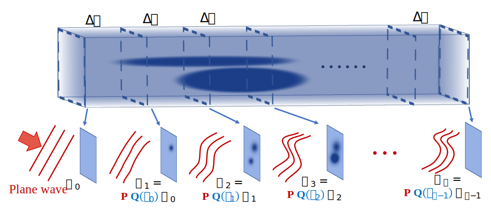

# SSNP-IDT: Split-step non-paraxial model for intensity diffraction tomography

Python implementation of paper: **High-fidelity intensity diffraction tomography with a non-paraxial multiple-scattering model**.

This repository includes a highly flexible and easy-to-use Python package based on PyCUDA library, and code examples for simulation and reconstruction.

## Introduction

We propose a novel intensity diffraction tomography (IDT) reconstruction algorithm based on the split-step non-paraxial (SSNP) model for recovering the 3D refractive index (RI) distribution of multiple-scattering biological samples.
High-quality IDT reconstruction requires high-angle illumination to encode both low- and high- spatial frequency information of the 3D biological sample.
Our SSNP model can more accurately compute multiple scattering from high-angle illumination compared to paraxial approximation-based multiple-scattering models.
We apply this SSNP model to both sequential and multiplexed IDT techniques. 
We develop a unified reconstruction algorithm for both IDT modalities that is highly computationally efficient and is implemented by a modular automatic differentiation framework.
We demonstrate the capability of our reconstruction algorithm on both weakly scattering buccal epithelial cells and strongly scattering live *C. elegans* worms and live *C. elegans* embryos.

### Annular and multiplexed IDT setups


### SSNP model and reconstruction



## Results visualization
### Annular IDT result


### Multiplexed IDT result


## Installation

1. Prepare the environment following the [pre-installation steps for PyCUDA](https://wiki.tiker.net/PyCuda/Installation/) on a computer with NVIDIA GPU
2. Install the `ssnp` package in this repository
```shell
pip install "git+https://github.com/bu-cisl/SSNP-IDT#subdirectory=ssnp_pkg"
```
3. Download the examples and run with Python

## License

Project is licensed under the terms of the GPL-v3 license. see the LICENSE file for details
